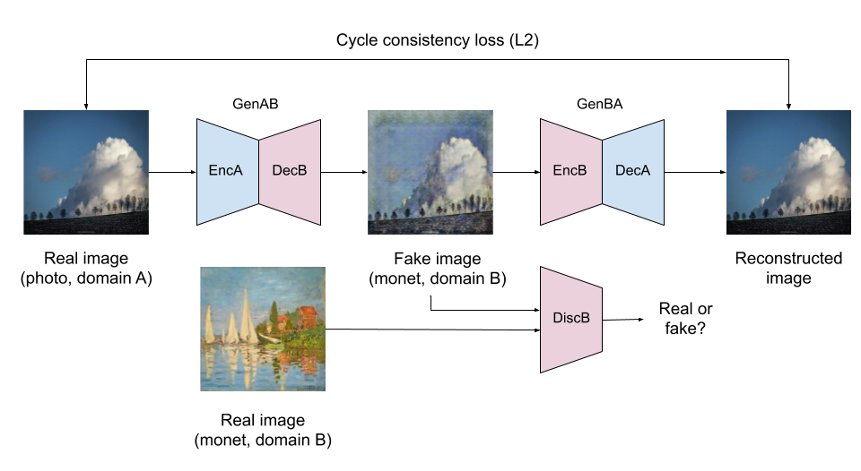
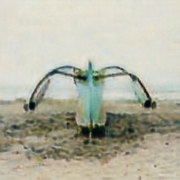

# Using GANs for Artistic Style Transfer
Final project for the Machine Learning course at Tsinghua University, Fall 2020


# Introduction 

The purpose of this project is to generate Claude Monet style images from real
photos using Generative Adversarial Networks, following the [Kaggle Competition
"I’m Something of a Painter Myself"](https://www.kaggle.com/c/gan-getting-started). 

We explored various GAN architectures applied to the style transfer problem, and select CycleGAN, MUNIT and UGATIT due to their impressive performance for similar applications. 

# Quick start

## Environment setup

Clone this repository to your system.

```
$ git clone https://github.com/hmartelb/GANs-for-artistic-style-transfer
```

Make sure that you have Python 3 installed in your system. It is recommended to create a virtual environment to install the dependencies. Open a new terminal in the master directory and install the dependencies from `requirements.txt` by executing this command:

```
$ pip install -r requirements.txt
```

## Model training

The `train.py` script contains the training loop, which is shared by the 3 models. You can run it by using the following command:

```
(venv) $ python train.py
```

You can also pass some arguments:

```
(venv) $ python train.py -- 
                         --
                         --
                         --
```
> Note: All the arguments are optional.

<!-- # Network architectures

## CycleGAN



## MUNIT


## U-GAT-IT

 -->

# Dataset

# Results

| Original | CycleGAN | MUNIT | UGATIT |
|:---:|:---:|:---:|:---:|
||||| 
||||| 
||||| 
||||| 
||||| 

<!-- # Contact 

Feel free to reach out you find any issue with the code or if you have any questions.

* Personal email: hmartelb@hotmail.com
* LinkedIn profile: https://www.linkedin.com/in/hmartelb/ -->

# License 

```
MIT License

Copyright (c) 2020 Héctor Martel

Permission is hereby granted, free of charge, to any person obtaining a copy
of this software and associated documentation files (the "Software"), to deal
in the Software without restriction, including without limitation the rights
to use, copy, modify, merge, publish, distribute, sublicense, and/or sell
copies of the Software, and to permit persons to whom the Software is
furnished to do so, subject to the following conditions:

The above copyright notice and this permission notice shall be included in all
copies or substantial portions of the Software.

THE SOFTWARE IS PROVIDED "AS IS", WITHOUT WARRANTY OF ANY KIND, EXPRESS OR
IMPLIED, INCLUDING BUT NOT LIMITED TO THE WARRANTIES OF MERCHANTABILITY,
FITNESS FOR A PARTICULAR PURPOSE AND NONINFRINGEMENT. IN NO EVENT SHALL THE
AUTHORS OR COPYRIGHT HOLDERS BE LIABLE FOR ANY CLAIM, DAMAGES OR OTHER
LIABILITY, WHETHER IN AN ACTION OF CONTRACT, TORT OR OTHERWISE, ARISING FROM,
OUT OF OR IN CONNECTION WITH THE SOFTWARE OR THE USE OR OTHER DEALINGS IN THE
SOFTWARE.
```